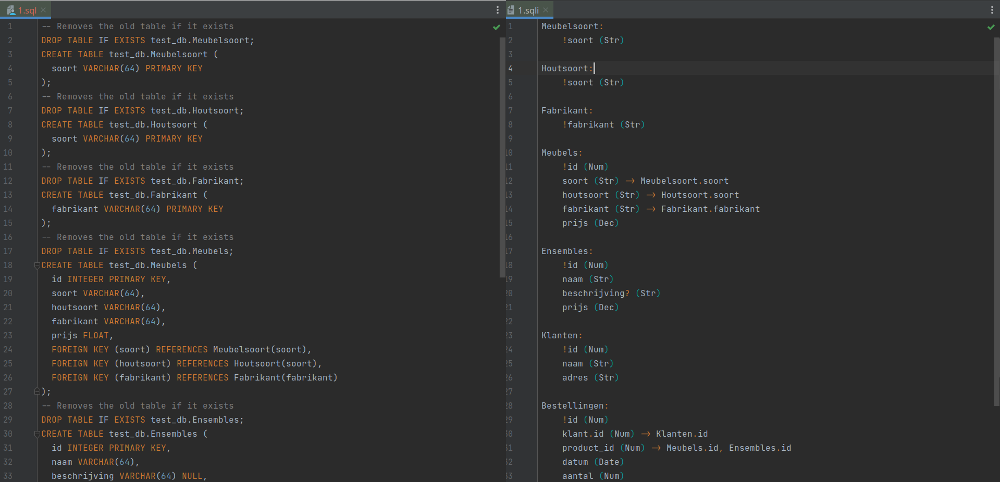

# SQLImagine
A tool for quickly and easily designing SQL databases using a DSL.


## Domain Specific Language
SQLImagine comes with a DSL for defining tables, attributes, and relationships called SQL-imagine, the file format is `.sqli`.
The parser is also able to return a reformatted existing scripts written in the DSL by calling `.serialize()` on the parsed DSL.
You can use the syntax highlighting from `YAML` because the DSL's syntax is similar.

```yaml
# It's possible to add comments.

Car:
  # The '!' means it's a primary key field.
  !name (Str)
  produced (Date)
  manufacturer (Str) -> Manufacturer.name
  color (Str)
  price (Dec)
  self_driving (Bool)
  
Manufacturer:
  name (Str)
  founded (Date)
  headquarters (Str)
  employees (Int)
  # The '?' signifies it's nullable.
  parent_company? (Str) -> Manufacturer.name
```

Parsing is done using the `ParseInstance` class.
It has several accessible properties:

|  Property  | Description                                                      |
|:----------:|:-----------------------------------------------------------------|
|  `tables`  | All parsed tables                                                |
|  `errors`  | All errors, issues that prevent the script from properly parsing |
| `warnings` | All warnings, issues that aren't critical but do require changes |
| `success`  | Whether there are any critical issues                            |
|   `time`   | The amount of milliseconds it took to parse the DSL              |

```kotlin
val scriptFile: File = …
val script: String = scriptFile.readText()
val parsed = ParseInstance(sqli)
// Print out a formatted version of the script.
println(parsed)
```

## SQL script export
You can export the parsed DSL as a SQL script by using the `Sequelizer` class on the parsed DSL.

```kotlin
val sequelizer = Sequelizer("test_db")
val sql: String = sequelizer.sequelize(parsed)
```


